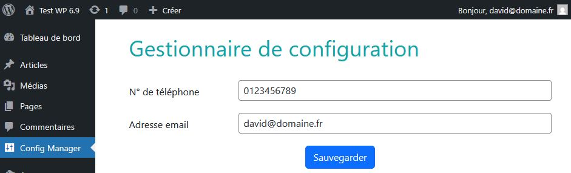

# Config Manager - Module WordPress

- [Config Manager - Module WordPress](#config-manager---module-wordpress)
  - [📋 Vue d'ensemble](#-vue-densemble)
  - [🎯 Objectifs pédagogiques](#-objectifs-pédagogiques)
  - [📁 Structure du fichier](#-structure-du-fichier)
  - [🔧 Analyse détaillée des méthodes](#-analyse-détaillée-des-méthodes)
  - [🔐 Concepts de sécurité appliqués](#-concepts-de-sécurité-appliqués)
- [Fichier admin-page.php = Vue (Template d'affichage)](#fichier-admin-pagephp--vue-template-daffichage)
  - [🔧 Analyse du code](#-analyse-du-code)
  - [🔄 Flux de données](#-flux-de-données)
    - [De la base de données vers le formulaire](#de-la-base-de-données-vers-le-formulaire)
    - [Du formulaire vers la base de données](#du-formulaire-vers-la-base-de-données)
  - [🔐 Sécurité appliquée](#-sécurité-appliquée)
  - [📝 Variables disponibles dans la vue](#-variables-disponibles-dans-la-vue)
  - [🔗 Liens avec les autres fichiers](#-liens-avec-les-autres-fichiers)
- [🎯 Pour aller plus loin](#-allez-plus-loin)
- [💡 Quelques bonnes pratiques WordPress](#-quelques-bonnes-pratiques-wordpress)

## 📋 Vue d'ensemble

Ce module WordPress permet de gérer des configurations personnalisées en les stockant dans la table `wp_options` de WordPress. Il s'agit d'un exemple pédagogique pour comprendre les bases du développement de plugins WordPress.

> [📥 Télécharger le module](https://downgit.github.io/#/home?url=https://github.com/webrelief/dwwm/tree/main/config-manager)

### Rendu final


## 🎯 Objectifs pédagogiques

- Comprendre la structure d'un plugin WordPress
- Utiliser les hooks WordPress (`add_action`)
- Interagir avec la base de données WordPress (`$wpdb`)
- Gérer les menus d'administration
- Charger des assets (CSS/JS)
- Utiliser les transients pour les messages temporaires

---

## 📁 Structure du fichier

```
config-manager/
├── config-manager.php          # Fichier principal du plugin
├── views/
│   └── admin-page.php          # Template d'affichage
└── assets/
    └── css/
        └── admin.css           # Styles personnalisés
```

---

## 🔧 Analyse détaillée des méthodes

### 1. En-tête du plugin

```php
/**
 * Plugin Name: Config Manager
 * Description: Module WordPress permettant d'ajouter des informations dans la table options de Wordpress
 * Version: 1.0
 * Author: David
 */
```

**Rôle :** Ces commentaires spéciaux permettent à WordPress de reconnaître le fichier comme un plugin. C'est **obligatoire** pour que le plugin apparaisse dans la liste des plugins.

**Champs importants :**
- `Plugin Name` : Nom affiché dans l'admin
- `Description` : Description visible dans la liste des plugins
- `Version` : Numéro de version du plugin
- `Author` : Auteur du plugin

---

### 2. Vérification de sécurité

```php
if (!defined('ABSPATH')) {
    exit;
}
```

**Rôle :** Empêche l'accès direct au fichier PHP depuis un navigateur.

**Explication :**
- `ABSPATH` est une constante définie par WordPress
- Si elle n'existe pas, c'est qu'on n'est pas dans WordPress
- On quitte immédiatement pour éviter les failles de sécurité

**Exemple d'attaque bloquée :** `https://monsite.com/wp-content/plugins/config-manager/config-manager.php`

---

### 3. Constructeur `__construct()`

```php
public function __construct()
{        
    add_action('admin_menu', [$this, 'addAdminMenu']);
    add_action('admin_enqueue_scripts', [$this, 'enqueueAssets']);
    add_action('admin_init', [$this, 'handleActions']);
}
```

**Rôle :** Initialise le plugin en enregistrant les hooks WordPress.

**Les hooks utilisés :**

| Hook | Quand il se déclenche | Méthode appelée |
|------|----------------------|-----------------|
| `admin_menu` | Lors de la construction du menu admin | `addAdminMenu()` |
| `admin_enqueue_scripts` | Lors du chargement des assets admin | `enqueueAssets()` |
| `admin_init` | Au début de chaque page admin | `handleActions()` |

**Syntaxe :** `[$this, 'nomMethode']` est un callback qui appelle une méthode de la classe actuelle.

---

### 4. Méthode `addAdminMenu()`

```php
public function addAdminMenu()
{
    add_menu_page(
        'Config Manager',           // Titre de la page
        'Config Manager',           // Texte du menu
        'manage_options',           // Capacité requise
        'config-manager',           // Slug (identifiant unique)
        [$this, 'renderAdminPage'], // Fonction callback
        'dashicons-admin-settings', // Icône
        30                          // Position dans le menu
    );
}
```

**Rôle :** Ajoute une nouvelle page dans le menu d'administration WordPress.

**Paramètres expliqués :**

- **`'Config Manager'` (titre)** : Titre affiché en haut de la page
- **`'Config Manager'` (menu)** : Texte affiché dans le menu latéral
- **`'manage_options'`** : Seuls les administrateurs peuvent y accéder
- **`'config-manager'`** : URL sera `admin.php?page=config-manager`
- **`[$this, 'renderAdminPage']`** : Fonction qui affiche le contenu
- **`'dashicons-admin-settings'`** : Icône du menu ([Liste des Dashicons](https://developer.wordpress.org/resource/dashicons/))
- **`30`** : Position (après "Commentaires" qui est à 25)

---

### 5. Méthode `enqueueAssets()`

```php
public function enqueueAssets($hook)
{
    if ($hook !== 'toplevel_page_config-manager') {
        return;
    }
    
    wp_enqueue_style(
        'bootstrap',
        'https://cdn.jsdelivr.net/npm/bootstrap@5.3.2/dist/css/bootstrap.min.css',
        [],
        '5.3.2'
    );
    
    wp_enqueue_style(
        'config-manager-admin',
        plugin_dir_url(__FILE__).'/assets/css/admin.css',
        ['bootstrap'],
        '1.0.0'
    );
    
    wp_enqueue_script(
        'bootstrap',
        'https://cdn.jsdelivr.net/npm/bootstrap@5.3.2/dist/js/bootstrap.bundle.min.js',
        [],
        '5.3.2',
        true
    );
}
```

**Rôle :** Charge les fichiers CSS et JavaScript uniquement sur la page du plugin.

**Vérification du hook :**
```php
if ($hook !== 'toplevel_page_config-manager') {
    return;
}
```
- Évite de charger Bootstrap sur toutes les pages admin
- Optimise les performances

**`wp_enqueue_style()` - Charger un CSS**

Syntaxe :
```php
wp_enqueue_style(
    'identifiant-unique',    // Handle (identifiant)
    'url-du-fichier.css',    // URL du fichier
    ['dependance'],          // Dépendances (array)
    '1.0.0'                  // Version
);
```

**`wp_enqueue_script()` - Charger un JS**

Syntaxe :
```php
wp_enqueue_script(
    'identifiant-unique',    // Handle
    'url-du-fichier.js',     // URL
    ['jquery'],              // Dépendances
    '1.0.0',                 // Version
    true                     // Charger dans le footer (true) ou header (false)
);
```

**`plugin_dir_url(__FILE__)` :** Retourne l'URL du dossier du plugin (ex: `https://monsite.com/wp-content/plugins/config-manager/`)

---

### 6. Méthode `renderAdminPage()`

```php
public function renderAdminPage()
{        
    $configs = $this->getAllConfigs();
    $message = $this->getMessage();
    include 'views/admin-page.php';
}
```

**Rôle :** Prépare les données et affiche le template de la page.

**Étapes :**
1. Récupère toutes les configurations depuis la base de données
2. Récupère le message de notification (s'il existe)
3. Inclut le fichier template qui affichera le HTML

**Pattern MVC :** C'est le "Controller" qui prépare les données pour la "View".

---

### 7. Méthode `getAllConfigs()`

```php
private function getAllConfigs()
{
    global $wpdb;
    $results = $wpdb->get_results(
        $wpdb->prepare(
            "SELECT option_name, option_value 
            FROM {$wpdb->options} 
            WHERE option_name LIKE %s",
            $wpdb->esc_like($this->prefix) . '%'
        )
    );
    foreach ($results as $row) {
        $key = str_replace($this->prefix, '', $row->option_name);
        $configs[$key] = $row->option_value;
    }
    return $configs;
}
```

**Rôle :** Récupère toutes les options qui commencent par `config_manager_`.

**Étape par étape :**

#### 1. Accès à la base de données
```php
global $wpdb;
```
- `$wpdb` est l'objet WordPress pour interagir avec la BDD
- `global` permet d'accéder à cette variable globale

#### 2. Requête SQL préparée
```php
$wpdb->prepare(
    "SELECT option_name, option_value 
    FROM {$wpdb->options} 
    WHERE option_name LIKE %s",
    $wpdb->esc_like($this->prefix) . '%'
)
```

**Pourquoi `prepare()` ?**
- Protège contre les injections SQL
- `%s` est un placeholder pour une chaîne de caractères
- WordPress remplace `%s` par la valeur échappée

**`$wpdb->esc_like()`** : Échappe les caractères spéciaux SQL (`%`, `_`) dans le préfixe.

**Exemple de résultat SQL :**
```sql
SELECT option_name, option_value 
FROM wp_options 
WHERE option_name LIKE 'config_manager_%'
```

#### 3. Transformation des résultats
```php
foreach ($results as $row) {
    $key = str_replace($this->prefix, '', $row->option_name);
    $configs[$key] = $row->option_value;
}
```

**Transformation :**
- `config_manager_api_key` → `api_key`
- `config_manager_email` → `email`

**Résultat final :**
```php
[
    'api_key' => 'ma_cle_api',
    'email' => 'contact@example.com'
]
```

---

### 4. Méthode `getMessage()`

```php
private function getMessage()
{
    $message = get_transient('config_manager_message');
    if ($message) {
        delete_transient('config_manager_message');
        return $message;
    }
    return null;
}
```

**Rôle :** Récupère et supprime le message de notification temporaire.

**Les transients WordPress :**

| Fonction | Rôle |
|----------|------|
| `set_transient($key, $value, $duration)` | Stocke une valeur temporaire |
| `get_transient($key)` | Récupère la valeur (ou `false` si expirée) |
| `delete_transient($key)` | Supprime immédiatement |

**Pourquoi supprimer après lecture ?**
- Le message ne doit s'afficher qu'une seule fois
- Évite qu'il réapparaisse au rafraîchissement

**Pattern "Flash Message" :**
1. Action effectuée → `set_transient()`
2. Redirection
3. Affichage → `get_transient()` puis `delete_transient()`

---

### 9. **Méthode `handleActions()`**

```php
public function handleActions()
{
    if (!current_user_can('manage_options')) {
        return;
    }
    
    if (isset($_POST['save_config'])) {
        foreach ($_POST as $key => $value) {
            if ($key !== 'save_config') {
                update_option($this->prefix.$key, $value);
            }
        }
        set_transient('config_manager_message', 'Config mise à jour avec succès', 30);
    }
}
```

**Rôle :** Traite la soumission du formulaire et enregistre les configurations.

#### 1. Vérification des permissions
```php
if (!current_user_can('manage_options')) {
    return;
}
```
- Vérifie que l'utilisateur a les droits d'administrateur
- Sécurité essentielle !

#### 2. Détection du formulaire
```php
if (isset($_POST['save_config'])) {
```
- Vérifie qu'un bouton "save_config" a été cliqué
- Identifie que c'est bien notre formulaire

#### 3. Sauvegarde des données
```php
foreach ($_POST as $key => $value) {
    if ($key !== 'save_config') {
        update_option($this->prefix.$key, $value);
    }
}
```

**Logique :**
- Parcourt tous les champs du formulaire (`$_POST`)
- Ignore le bouton "save_config"
- Enregistre chaque champ avec le préfixe `config_manager_`

**Exemple :**
- Champ `api_key` → Enregistré comme `config_manager_api_key`
- Champ `email` → Enregistré comme `config_manager_email`

#### 4. Message de confirmation
```php
set_transient('config_manager_message', 'Config mise à jour avec succès', 30);
```
- Stocke le message pour 30 secondes
- Sera affiché après la redirection

---

## 🔐 Concepts de sécurité appliqués

### 1. Protection contre l'accès direct
```php
if (!defined('ABSPATH')) exit;
```

### 2. Vérification des permissions
```php
if (!current_user_can('manage_options')) return;
```

### 3. Requêtes SQL préparées
```php
$wpdb->prepare("SELECT ... WHERE option_name LIKE %s", $value)
```

### 4. Échappement SQL
```php
$wpdb->esc_like($this->prefix)
```

### 5. Échappement HTML dans la vue
```php
echo esc_html($value);       // Pour le texte
echo esc_attr($value);       // Pour les attributs
echo esc_url($url);          // Pour les URLs
```

---

# Fichier admin-page.php = Vue (Template d'affichage)

Ce fichier est le **template HTML** (la "Vue") qui affiche l'interface d'administration du plugin Config Manager. Il contient uniquement du HTML et du PHP d'affichage, sans logique métier.

---

## 🔧 Analyse du code

### 1. Vérification de sécurité

```php
if (!defined('ABSPATH')) {
    exit;
}
```

**Rôle :** Empêche l'accès direct au fichier via le navigateur.

- Même protection que dans le fichier principal
- Obligatoire dans tous les fichiers PHP du plugin

---

### 2. Structure principale

```php
<div class="config-manager">
    <h1>Gestionnaire de configuration</h1>
    <!-- Contenu -->
</div>
```

**Rôle :** Conteneur principal de la page avec une classe unique pour le CSS.

---

### 3. Affichage du message de confirmation

```php
<?php if ($message) { ?>
    <div class="alert alert-success alert-dismissible fade show" role="alert">
        <?php echo esc_html($message); ?>
        <button type="button" class="btn-close" data-bs-dismiss="alert"></button>
    </div>
<?php } ?>
```

**Rôle :** Affiche le message de succès après la sauvegarde.

**Détails :**

- **`if ($message)`** : Vérifie qu'un message existe
- **`alert alert-success`** : Classes Bootstrap 5 pour le style
- **`alert-dismissible fade show`** : Animation d'apparition et bouton de fermeture
- **`esc_html($message)`** : Échappe le HTML pour la sécurité
- **`data-bs-dismiss="alert"`** : Attribut Bootstrap pour fermer l'alerte

**Provenance de `$message` :**
Cette variable est définie dans `renderAdminPage()` du Controller :
```php
$message = $this->getMessage();
```

---

### 4. Formulaire de configuration

```php
<form method="post">
    <!-- Champs du formulaire -->
    <button type="submit" name="save_config" class="btn btn-primary">Sauvegarder</button>
</form>
```

**Rôle :** Formulaire HTML pour éditer les configurations.

**Points importants :**

- **`method="post"`** : Envoie les données en POST (plus sécurisé que GET)
- **Pas d'attribut `action`** : Le formulaire se soumet à la page actuelle
- **`name="save_config"`** : Identifiant du bouton vérifié dans `handleActions()`

---

### 5. Champ Téléphone

```php
<div class="row mb-3">
    <label for="inputTel" class="col-sm-2 col-form-label">N° de téléphone</label>
    <div class="col-sm-10">
        <input type="text" 
               name="telephone" 
               class="form-control" 
               id="inputTel" 
               value="<?php if (isset($configs['telephone'])) { echo $configs['telephone']; }?>">
    </div>
</div>
```

**Rôle :** Champ de saisie pour le numéro de téléphone.

**Structure Bootstrap :**
- **`row mb-3`** : Ligne avec marge en bas (margin-bottom: 1rem)
- **`col-sm-2`** : Label prend 2 colonnes sur 12
- **`col-sm-10`** : Input prend 10 colonnes sur 12

**Attributs de l'input :**

| Attribut | Valeur | Rôle |
|----------|--------|------|
| `type` | `text` | Type de champ (texte libre) |
| `name` | `telephone` | Nom du champ envoyé en POST |
| `class` | `form-control` | Classe Bootstrap pour le style |
| `id` | `inputTel` | Identifiant unique pour le label |
| `value` | `<?php ... ?>` | Valeur actuelle du champ |

**Affichage de la valeur :**
```php
<?php echo $configs['telephone'] ?? ''; }?>
```

**Explication de `??` :**
- Si `$configs['telephone']` existe → affiche sa valeur
- Sinon → affiche une chaîne vide `''`


---

### 6. Bouton de soumission

```php
<button type="submit" name="save_config" class="btn btn-primary">Sauvegarder</button>
```

**Rôle :** Soumet le formulaire et déclenche la sauvegarde.

**Attributs importants :**

| Attribut | Valeur | Rôle |
|----------|--------|------|
| `type` | `submit` | Soumet le formulaire au clic |
| `name` | `save_config` | Identifiant vérifié dans `handleActions()` |
| `class` | `btn btn-primary` | Classes Bootstrap (bouton bleu) |

**Flux de traitement :**
1. Utilisateur clique sur "Sauvegarder"
2. Formulaire envoyé en POST à la même page
3. `handleActions()` détecte `$_POST['save_config']`
4. Les données sont sauvegardées
5. Page rechargée avec message de confirmation

---

## 🔄 Flux de données

### De la base de données vers le formulaire

```
Base de données (wp_options)
    ↓
getAllConfigs() dans le Controller
    ↓
$configs passé à la vue
    ↓
Affichage dans les champs (value="...")
```

### Du formulaire vers la base de données

```
Utilisateur remplit le formulaire
    ↓
Clic sur "Sauvegarder"
    ↓
$_POST contient les données
    ↓
handleActions() traite les données
    ↓
update_option() enregistre dans wp_options
    ↓
set_transient() crée le message de confirmation
    ↓
Page rechargée
    ↓
getMessage() récupère le message
    ↓
Affichage de l'alerte de succès
```

---

## 🔐 Sécurité appliquée

### 1. Protection contre l'accès direct
```php
if (!defined('ABSPATH')) exit;
```

### 2. Échappement HTML
```php
echo esc_html($message);
```
- Convertit les caractères spéciaux en entités HTML
- Empêche les attaques XSS (Cross-Site Scripting)

**Exemple :**
```php
$message = "<script>alert('XSS')</script>";
echo esc_html($message); 
// Affiche : &lt;script&gt;alert('XSS')&lt;/script&gt;
```

---

## 📝 Variables disponibles dans la vue

Ces variables sont passées depuis le Controller via `renderAdminPage()` :

| Variable | Type | Contenu |
|----------|------|---------|
| `$configs` | array | Configurations depuis la BDD |
| `$message` | string ou null | Message de confirmation |

**Exemple de `$configs` :**
```php
[
    'telephone' => '0123456789',
    'email' => 'contact@example.com'
]
```

---

## 🔗 Liens avec les autres fichiers

### config-manager.php (Controller)
```php
public function renderAdminPage()
{        
    $configs = $this->getAllConfigs();  // ← Prépare $configs
    $message = $this->getMessage();      // ← Prépare $message
    include 'views/admin-page.php';      // ← Inclut ce fichier
}
```

### Ce fichier (Vue)
```php
<?php echo esc_html($message); ?>                    // ← Utilise $message
value="<?php echo $configs['telephone'] ?? ''; ?>"   // ← Utilise $configs
```

---

## 🎯 Allez plus loin
### Tester le module : 

Pour vérifier la présence des options ajoutées dans la table ```wp_options```
vous pouvez exécuter la requête SQL suivante dans phpMyAdmin : 
```SELECT * FROM `wp_options` where option_name LIKE 'config_manager%'; ```

### Récupérer les valeurs de la table ```wp_options```
Dans votre thème, ou dans n'importe quel développement Wordpress, vous pouvez récupérer les valeurs de la table ```wp_options```
à condition de connaître la clé associée.

Pour cela, il suffit d'utiliser la fonction ```get_option('cle')``` avec la clé en paramètre
Dans notre exemple, nos champs de formulaires étant sauvegardés en base avec le prefix ```config_manager_```
nous pouvons les récupérer de la manière suivante : 

```
$telephone = get_option('config_manager_telephone');
$email = get_option('config_manager_email');
```

#### 💡 Idées de mise en pratique :
1. Ajouter des champs dans le formulaire (Lien LinkedIn, adresse postale, code postal et ville...)
2. Récupérer les champs de votre module dans le footer de votre thème pour afficher ces informations de contact.

---

## 💡 Quelques bonnes pratiques WordPress

### 1. Utiliser les fonctions WordPress
❌ **À éviter :**
```php
mysql_query("SELECT * FROM wp_options WHERE ...");
```

✅ **Préférer :**
```php
$wpdb->get_results($wpdb->prepare("SELECT ..."));
```

### 2. Préfixer les options
```php
private $prefix = 'config_manager_';
```
- Évite les conflits avec d'autres plugins
- Permet de retrouver facilement vos options

### 3. Charger les assets conditionnellement
```php
if ($hook !== 'toplevel_page_config-manager') {
    return;
}
```
- Optimise les performances
- Évite les conflits CSS/JS

### 4. Utiliser les hooks WordPress
```php
add_action('admin_menu', [$this, 'addAdminMenu']);
```
- S'intègre proprement dans WordPress
- Respecte le cycle de vie de WordPress

---
