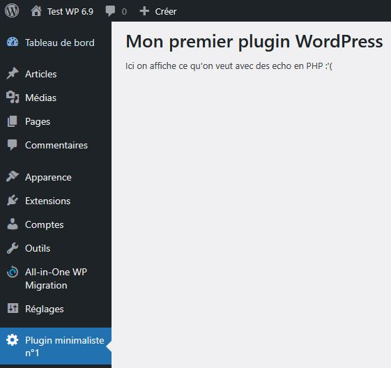
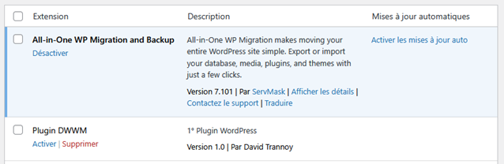

# Structure d'un module Wordpress : 

Le dossier d'un plugin doit être copier/coller (ou uploadé) dans le dossier wp-content/plugins de Wordpress.

Il doit contenir au minimum un fichier .php qui a le même nom que le dossier.
Exemple ci-dessous : 
Dossier mon-plugin
Fichier  mon-plugin.php


Il est fortement recommandé de créer également un fichier readme.md ([cf. annexe readme](../readmes.md)).

```text
mon-plugin
├── mon-plugin.php
├── readme.md
```

## Rendu final de ce plugin de démonstration : 


> [Télécharger ce plugin](https://downgit.github.io/#/home?url=https://github.com/webrelief/dwwm/tree/main/dwwm-plugin-1)

## Le fichier principal  : 

### Premières lignes : commentaires 
Le fichier princiapl de votre plugin doit **OBLIGATOIREMENT** commencer par des commentaires.
Les commentaires sont de type PHPDoc, et doivent commencer avec 2 *

```php
<?php
/**
 * Plugin Name: Plugin DWWM 1
 * Description: 1° Plugin WordPress
 * Version: 1.0
 * Author: David Trannoy
 */
```

Ces commentaires sont lus par Wordpress pour que l’extension s’affiche correctement dans la liste de vos extensions Wordpress, et ainsi qu'elle puisse être activée.



### Petit controle de sécurité propre à Wordpress : 

```php
if (!defined('ABSPATH')) { 
    exit; // petite sécurité Wordpress
}
```

### Création d'un lien dans le menu : 
Tout d'abord, on créé une fonction PHP.
Cette fonction va faire appel à la fonction wordpress au nom explicite : ```add_menu_page() ```

```php
function dwwm_1_menu() {
    add_menu_page(
        'Plugin 1', // Meta title de la page du plugin
        'Plugin minimaliste n°1', // Libellé dans le menu
        'manage_options', // Pour la gestion des droits des utilisateurs
        'dwwm-plugin-1', // Slug du menu, doit être unique
        'dwwm_1_plugin_page' // Fonction utilisée pour générer la page
    );
}
```
Le dernier paramètre de add_menu_page est la fonction qui sera exécutée lorsque l'admin cliquera sur le lien du menu. (Nous allons définir cette fonction un peu plus bas).

Wordpress utilise un système de Hook (crochets).
Ces hooks sont appelés un peu partout sur le site et permettent d'ajouter des fonctionnements spécifiques.
Pour ajouter une fonction à un hook, il faut utiliser la fonction ```add_action()``` avec 2 paramètres : 
- le hook sur lequel on souhaite se greffer
- la fonction qui sera appelé lors de l'exécution du hook

Ici, ça reste simple, il y a un hook nommé 'admin_menu' qui s'exécute lorsque Wordpress génère le menu admin.
On appelle la fonction créée précédemment et qui ajoute un élément de menu.

```php
// Hook pour ajouter un menu admin
add_action('admin_menu', 'dwwm_1_menu');
```


### Création d'une page pour ce module : 
Ici nous créons une page très simple en PHP qui génère un affichage HTML minimaliste : 
```php
function dwwm_1_plugin_page() {
    echo '<h1>Mon premier plugin WordPress</h1>';
    echo '<p>Ici on affiche ce qu\'on veut avec des echo en PHP :\'( </p>';
}
```
Cette fonction ```dwwm_1_plugin_page()``` correspond au dernier paramètre de : ```add_menu_page() ```

